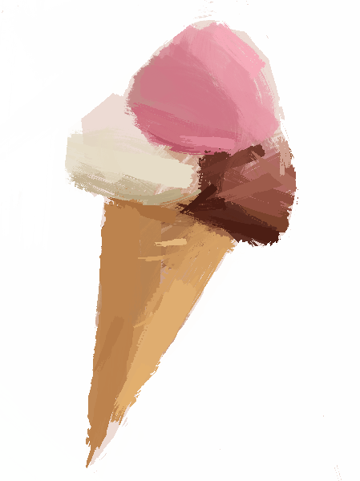
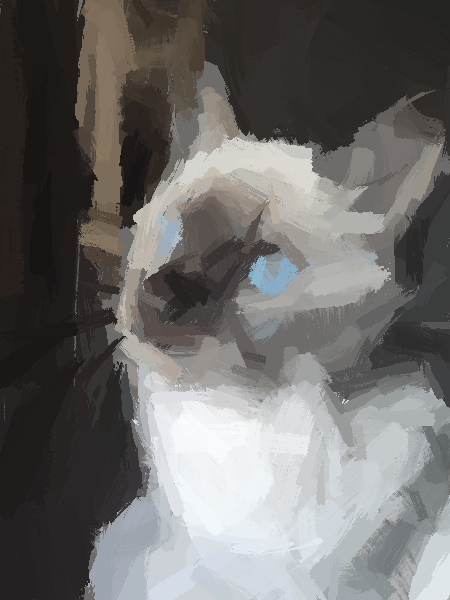

# Genart

Image generation with genetic algorithms

### Some renders

_[Fig 1] - Mona Lisa. 300 objects_

_[Fig 2] - The Great Wave of Kanagawa by Katsushika Hokusai. 1000 objects_

_[Fig 3] - Lamborghini Aventador. 200 objects_

_[Fig 4] - Milky Way. 200 objects_

_[Fig 5] - Ice cream. 100 brush strokes_

_[Fig 4] - My cat Uma. 300 brush strokes_
