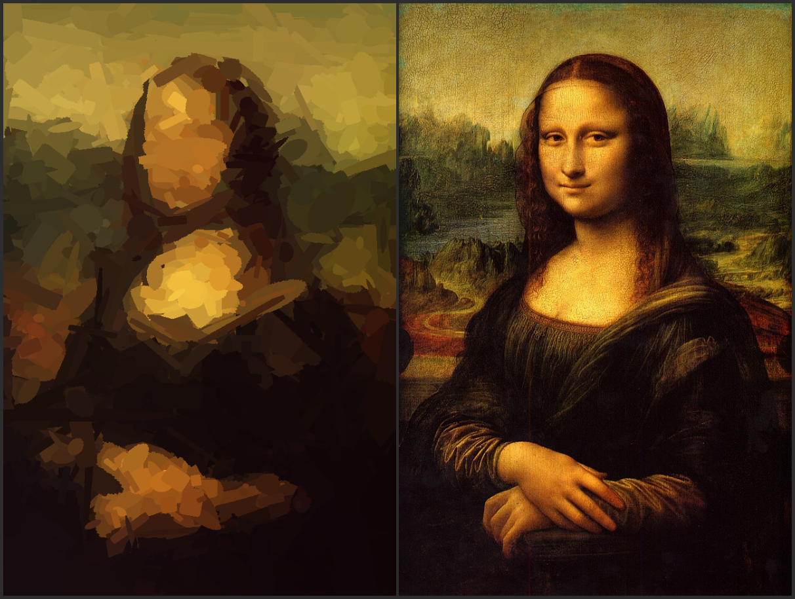

# GeneticArt

Image generation with genetic algorithms

First render with 2000 objects took 2 minutes and 47 seconds. The genetic algorithm has not been implemented yet. For each object, 100 candidates are tested. Each candidate is evaluated using the mean squared error in the CIELab color space, and the best-performing candidate is selected.
