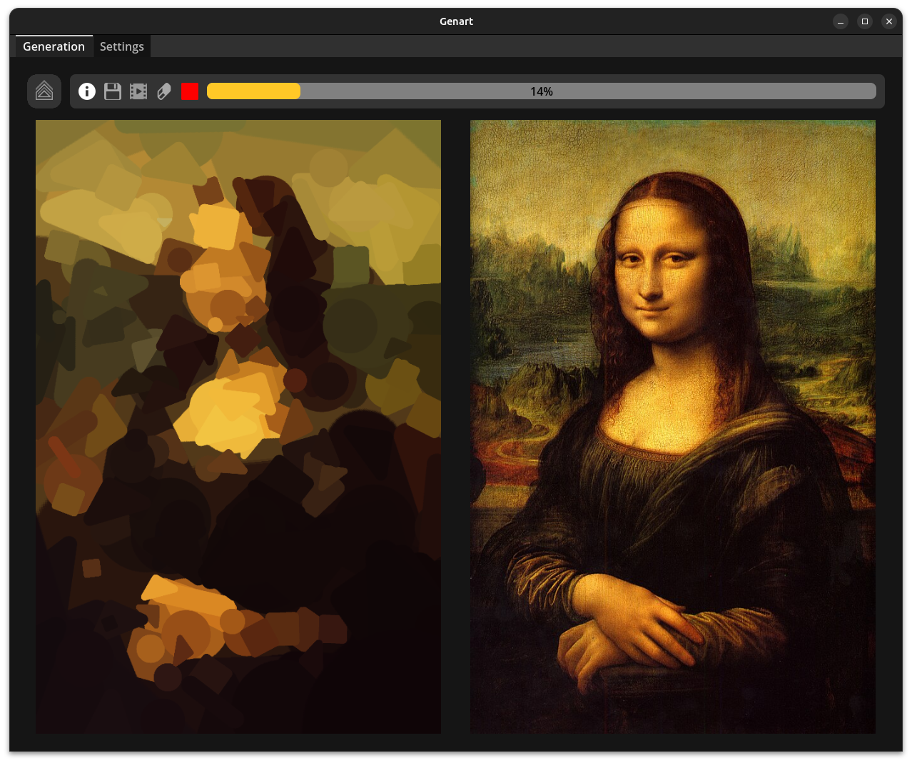
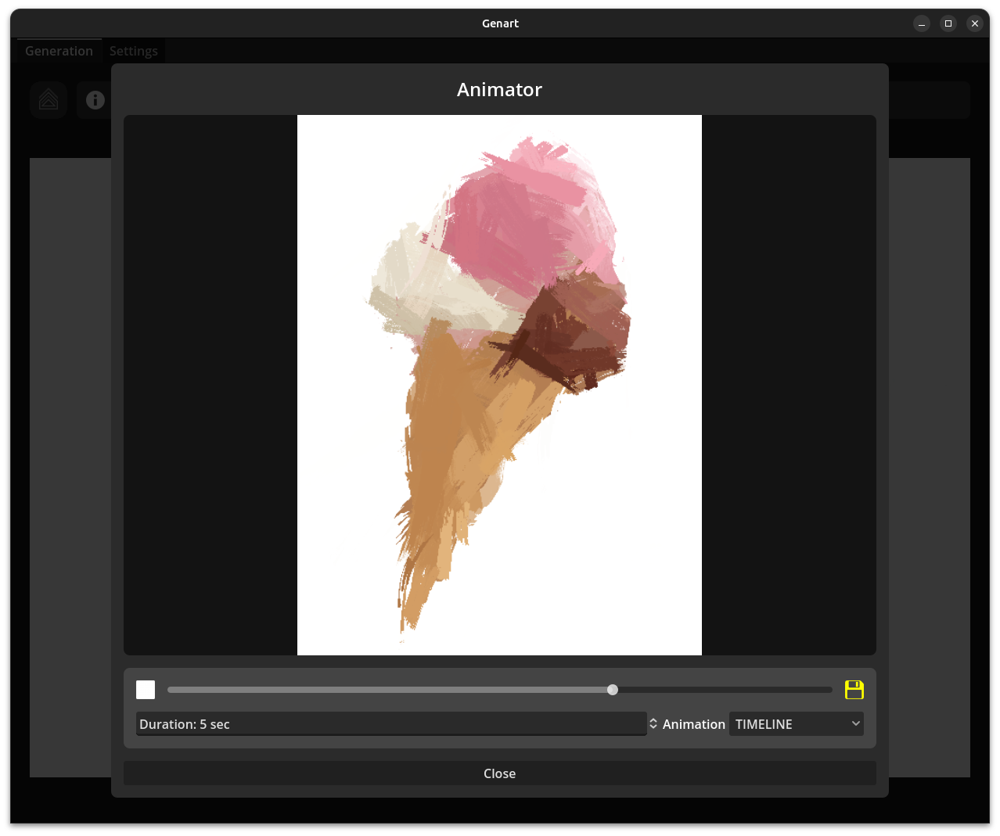

</img>

Genart is an application that transforms your target image into uniquely stylized artwork.
Smaller images are used as building blocks to reconstruct the target picture.

This tool is perfect for artists, designers, or anyone looking to experiment with creative and abstract image representations.

</img>

## Features

- Reconstruct any image using a chosen set of smaller images as building blocks.
- Save generated artwork in formats such as PNG, JPG, and JPEG.
- Create dynamic animations with GenArt's integrated animator.
- Optimize results easily with predefined FAST, PERFORMANCE, and QUALITY modes.
- Utilize default image collections for effortless creation.
- Fully customizable algorithm with a wide range of settings.

## Animator

</img>

Animations are exported as a sequence of images, therefore using a tool such as [ffmpeg](https://www.ffmpeg.org/) is required in order to generate a video or gif.

|                               Timeline                                |                               Scale all                                |                             Translate from top                             |                               Wave from left                                |
| :-------------------------------------------------------------------: | :--------------------------------------------------------------------: | :------------------------------------------------------------------------: | :-------------------------------------------------------------------------: |
|  |  |  |  |

## Installing

You can download the last github release or build the project yourself by cloning the source code and using Godot 4.3.

## Gallery

Some examples with different images as building blocks.

|  |
| :------------------------------------------------------------------------------------: |
|                        _Mona Lisa. 300 fixed rotation capsules_                        |

|  |
| :------------------------------------------------------------------------------: |
|              _Lamborghini Aventador. 200 geometric rounded objects_              |

|  |
| :-----------------------------------------------------------------------------------------: |
|                             _Billie Eilish. 500 brush strokes_                              |

|  |
| :----------------------------------------------------------------------------------------: |
|                               _Milky Way. 200 glow objects_                                |

