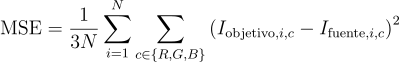
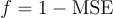
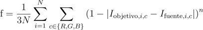

# Algoritmo genético para replicación de imágenes estilizadas

Código de proyecto: GAFSIR (Genetic Algorithm for Stylized Image replication)

_Franco Yudica (13922)_

## Indice

- [Introducción](#introducción)
- [Marco teórico](#marco-teórico)

  - [Introducción de algoritmo genético](#introducción-de-algoritmo-genético)
  - [Justificación](#justificación)

- [Diseño experimental](#diseño-experimental)

  - [Implementación](#implementación)
    - [Generación de imagen](#generación-de-imagen)
      - [Algoritmo de generación de individuo](#algoritmo-de-generación-de-individuo)
        - [Construcción de la imagen](#construcción-de-la-imagen)
        - [Condiciones de parada](#condiciones-de-parada)
    - [Algoritmo aleatorio](#algoritmo-aleatorio)
    - [Algoritmo genético](#algoritmo-genético)
      - [Individuo](#individuo)
      - [Función de fitness](#función-de-fitness)
        - [MSE](#mse-mean-squared-error)
        - [MPA](#mpa-mean-power-accuracy)
      - [Inicialización del algoritmo](#inicialización-del-algoritmo)
      - [Operadores](#operadores)
        - [Selección](#selección)
        - [Crossover](#crossover)
        - [Mutación](#mutación)
        - [Selección de sobrevivientes](#selección-de-sobrevivientes)
        - [Criterio de finalización](#criterio-de-finalización)

- [Bibliografía](#bibliografía)

# Introducción

En este proyecto se ha desarrollado un método para generar imágenes _transformadas estéticamente_ utilizando técnicas de computación evolutivas. Al aplicar un algoritmo genético para replicar una imagen a través de modificaciones iterativas, se busca no solo aproximar la imagen original, sino también explorar una estética única, diferente a otras tales como las foto mosaicos, pointillism, pixelart, entre otros.

Se considera que el abordar el problema mediante el uso de IA es una excelente decisión, debido a que esta se centra en el desarrollo de sistemas capaces de adaptarse y tomar decisiones en función de su entorno, siendo esta una característica últil en los procesos de generación de imágenes.

A continuación se explicarán los fundamentos del algoritmo genético, los motivos por los que se decide usarlo, la implementación del mismo, las métricas utilizadas con el fin de establecer el alcance y rendimiento del algoritmo sobre el problema dado, herramientas de implementación, una descripción de los experimentos y resultados obtenidos, en conjunto con un análisis de los mismos y finalmente conlcusiones sobre el proyecto.

# Marco teórico

## Introducción de algoritmo genético

Existe una gran variedad de algoritmos genéticos, pero todos tienen en común la siguiente idea:

Si se cuenta con una población de individuos en un entorno que cuenta con recursos limitados, la competencia entre los individuos por tales recursos produce la supervivencia de los más aptos, también denominada selección natural. Esto causa un aumento en la aptitud de la población remanente.

Dada una función de calidad a maximizar, podemos crear aleatoriamente un conjunto de soluciones candidatas, es decir, elementos del dominio de la función. Luego aplicamos la función de calidad a estas como una medida abstracta de aptitud: cuanto mayor sea, mejor. Con base en estos valores de aptitud, se eligen algunas de las mejores candidatas para sembrar la próxima generación. Esto se realiza aplicando recombinación y/o mutación sobre ellas.

La recombinación es un operador que se aplica a dos o más candidatas seleccionadas (los llamados padres), produciendo una o más nuevas candidatas (los hijos). La mutación se aplica a una candidata y da como resultado una nueva candidata. Por lo tanto, al ejecutar las operaciones de recombinación y mutación sobre los padres, se crea un conjunto de nuevas candidatas (la descendencia). Estas nuevas candidatas tienen su aptitud evaluada y luego compiten, basándose en su aptitud (y posiblemente su edad), con las antiguas por un lugar en la próxima generación. Este proceso puede iterarse hasta que se encuentre una candidata con calidad suficiente (una solución) o se alcance un límite computacional previamente establecido.

Existen dos fuerzas principales que forman la base de los sistemas evolutivos:

- Operadores de variación (recombinación y mutación): crean la diversidad necesaria dentro de la población y, de este modo, facilitan la aparición de novedades.
- Selección: actúa como una fuerza que incrementa la calidad media de las soluciones en la población.

La aplicación combinada de la variación y la selección generalmente conduce a la mejora de los valores de aptitud en poblaciones consecutivas. Es fácil visualizar este proceso como si la evolución estuviera optimizando (o al menos "aproximando") la función de aptitud, acercándose cada vez más a los valores óptimos con el tiempo.

Es importante destacar que muchos componentes de los procesos evolutivos son estocásticos. Por ejemplo, la selección de los mejores individuos no es completamente determinista; incluso los individuos menos aptos suelen tener alguna probabilidad de convertirse en padres o de pasar a la siguiente generación. Durante el proceso de recombinación, la elección de qué atributos de cada padre serán combinados es aleatoria. De manera similar, en el caso de la mutación, la selección de los atributos a modificar en una solución candidata también sigue un comportamiento aleatorio.

[_Introduction to evolutionary computing second edition_](#bibliografía)

## Justificación

En este proyecto se ha optado por utilizar algoritmos genéticos, ya que el proceso de generación de imágenes puede simplificarse como una serie de búsquedas locales.

El problema a resolver se clasifica como una búsqueda local, dado que no se busca la mejor solución absoluta (que en este caso sería la imagen objetivo, la cual se proporciona como parámetro al algoritmo), sino aproximaciones de calidad.

Un algoritmo genético es especialmente adecuado para este problema debido a su capacidad para mantener la diversidad en la población, lo que ayuda a evitar caer en óptimos locales. Además, gracias a los operadores de variación y selección, es posible ampliar el espacio de búsqueda y descubrir soluciones de alta calidad.

**Aspectos adicionales:**

- No es de interés analizar los pasos intermedios que realiza el algoritmo genético para alcanzar la solución.
- El entorno es observable, determinista y estático, lo que lo hace ideal para la aplicación de algoritmos genéticos.
- Los algoritmos genéticos son altamente configurables, lo que permite adaptarlos a diferentes entornos y necesidades. Esta flexibilidad ofrece un amplio margen para explorar diversas estrategias en la generación de imágenes.

# Diseño experimental

## Implementación

### Generación de imagen

La _imagen final_ se generará mediante iteraciones sucesivas y acumulativas de un algoritmo de **generación de individuo**.

#### Algoritmo de generación de individuo

Dadas dos imágenes, una denominada _imagen fuente_ la cuál representa el progreso logrado en la generación de la imagen y otra denominada _imagen objetivo_, se busca encontrar al individuo que, al ser renderizado sobre la _imagen fuente_, produzca una nueva imagen que sea lo más similar posible a la _imagen objetivo_.

Es importante tener en mente la diferencia entre _imagen fuente_ e _imagen objetivo_ debido a que seran ampliamente referidas a partir de este punto.

#### Construcción de la imagen

1. Se inicializa la _imagen fuente_ pintada con el color promedio de la _imagen objetivo_, **Imagen<sub>0</sub>**, **Imagen<sub>i</sub>** = **Imagen<sub>0</sub>**.
2. Se ejecuta el algoritmo de generación de individuo sobre **Imagen<sub>i</sub>**.
3. Se obtiene el mejor individuo y lo renderiza sobre **Imagen<sub>i</sub>**, obteniendo una nueva _imagen fuente_, **Imagen<sub>(i+1)</sub>**.
4. Si se cumple la **_condición de parada_**, la generación de la imagen termina.
5. Vuelve al paso 2, pero con **Imagen<sub>(i+1)</sub>**.

#### Condiciones de parada

- **Cantidad de individuos generados**: La generación de imagen finaliza al alcanzar una cantidad de individuos previamente establecida.
- **Tiempo de ejecución**: La generación de imagen finaliza tras pasar una cantidad de tiempo específica.
- **Valor de métrica**: El proceso de generación de imagen continúa indefinidamente hasta lograr un valor específico de la métrica seleccionada.

### Algoritmo aleatorio

### Algoritmo genético

El algoritmo genético es un algoritmo de generación de individuo.

#### Individuo

Los individuos cuentan con una serie de atributos genéticos que brinan suficiente flexibilidad para representar distintas formas y colores:

- **Textura**: El algoritmo genético toma como entrada un conjunto de texturas que serán utilizadas por los individuos. Cada individuo posee un atributo llamado textura, el cual corresponde a una de las texturas proporcionadas al algoritmo. Las texturas pueden asignarse a múltiples individuos, permitiendo su repetición dentro de la población.
- **Posición**: Vector bidimensional dominio [0, N]x[0, M], donde N es el ancho y M el alto de la imagen objetivo. Determina la posición donde se renderizará la textura.
- **Tinte**: Es un color utilizado para pintar la textura. Es vital para que los individuos tomen colores en función de su posición.
- **Tamaño**: Vector bidimensional de enteros que representa la resolución en unidad de pixeles con la que se renderizará la textura. Nótese que el tamaño no necesariamente coincide con la resolución original de la textura seleccionada, brindando mayor versatilidad para poder cubrir regiones de distintos tamaños.
- **Rotación**: La textura puede ser rotada [0, 2PI], teniendo como pivote el centro de la textura.

En definitiva, un individuo puede interpretarse como una sub-imagen que se renderizará sobre la _imagen fuente_ con el objetivo de lograr la mayor semejanza posible con _imagen objetivo_.

#### Función de fitness

La función de fitness, recibe como parámetro un indiduo y retorna un valor del intervalo [0.0, 1.0]. Donde el peor fitness posible es 0, y el mejor 1.

```c++
float fitness(individual) {...}
```

Esta función realiza las siguientes tareas:

1. Renderiza al individuo sobre la _imagen fuente_, obteniendo la _imagen fuente del individuo_.
2. Envía la _imagen fuente del individuo_ a una función que se encargará de determinar la diferencia entre esta y la _imagen objetivo_, retornando un valor normalizado que representa el fitness del individuo.

En este proyecto se implementaron dos funciones de cálculo de fitness:

##### MSE (Mean Squared Error)



Donde:

- **N**: Es la cantidad de pixeles de la imagen.
- **{R, G, B}**: Es el conjunto de canales sobre los cuales se calculará la diferencia. Cada canal toma un valor normalizado del intervalo: [0.0, 1.0].
- La diferencia de realiza entre la _imagen objetivo_ y la _imagen fuente del individuo_.

Nótese que MSE está dividido por la cantidad de canales, motivo por el cuál MSE tomará el valor de 0 cuando las imágenes sean idénticas, pero tomará 1.0 cuando sean completamente distintas.

Luego, el fitness se calcula como:



Esto se debe a que el fitness debe medir la similitud y no el error.

MSE es una posible función de fitness que logrará su tarea, pero la distribución de fitness no será la deseada debido a que se trabaja con valores normalizados. Al aplicar cualquier potencia mayor a 1.0 en un valor normalizado, el resultado es un número más chico que el de la base. Esto significa que MSE, en este caso, disminiye el error calculado.

##### MPA (Mean Power Accuracy)

Debido a los motivos mensionados anteriormente, se decidió implementar otra función de fitness:



A primera vista resulta similar a MSE, pero en realidad tiene una gran diferencia. En lugar de realizar la sumatoria del error cuadrático, se realiza la sumatoria de la exactitud potenciada a cierto valor.

De esta forma la penalización aumenta sobre aquellos canales cuyo error sea mayor.

La siguiente función de fitness es la planteada en [Procedural Paintings with Genetic Evolution Algorithm](https://shahriyarshahrabi.medium.com/procedural-paintings-with-genetic-evolution-algorithm-6838a6e64703), la cuál utiliza la potencia `n = 4`:


#### Inicialización del algoritmo

Se mantiene una población de tamaño fijo a lo largo de toda la ejecución del algoritmo. La población inicial está formada por individuos con los siguientes atributos aleatorizados:

- Textura
- Posición
- Tamaño
- Rotación

##### Tinte del individuo

Nótese que el **tinte** de los individuos nunca será aleatorizado, esto será fundamental para reducir los tiempos de convergencia del algoritmo. En lugar de aleatorizar el tinte, se calculará el color promedio de la sub-imagen que ocupe el individuo, y se utilizará este color como tinte del individuo. Esto es sumamente importante y necesario, teniendo en cuenta que la función de fitness puede dar valores iguales para texturas con colores distintos.

Cabe aclarar que la implementación de la función de fitness toma en cuenta esta propiedad. Si los colores fueran aleatorizados, entonces se debería mejorar la función de fitness, cambiando el espacio RGB a uno que sea perceptualmente uniforme, tal como CEILab.

Existen estudios que debido a la aleatorización de colores se han encontrado con este mismo problema, y utilizan representaciones de colores en espacios alternativos para su función de fitness, tales como el espacio CEILab o PSNR:

- [Genetic algorithm for image recreation](https://medium.com/@sebastian.charmot/genetic-algorithm-for-image-recreation-4ca546454aaa).

- [Procedural Paintings with Genetic Evolution Algorithm](https://shahriyarshahrabi.medium.com/procedural-paintings-with-genetic-evolution-algorithm-6838a6e64703).

- [EllipScape](https://aisel.aisnet.org/cgi/viewcontent.cgi?article=1613&context=hicss-57).

#### Operadores

##### Selección

Este operador determina cuáles son los individuos que serán seleccionados para la reproducción.

No se opta por la selección basada en fitness porque el fitness de los individuos suele ser muy parecido, lo cuál significaría que la selección basada en fitness convergería en la mayoría de los casos a una selección aleatoria.

Por este motivo se utiliza el operador de **selección basado en ranking**, donde la probabilidad de cada individuo de ser seleccionado depende de su ranking y no de su fitness. Este método asegura una distribución probabilística constante, evitando caer en una distribución aleatoria uniforme.

##### Crossover

Este operador recibe a dos padres y crea un hijo.
Los atributos genéticos son utilizados por este método son los siguientes:

- Textura
- Posición
- Tamaño
- Rotación

Debido a que la posición el tamaño y la rotación están formados por números reales, es posible realizar interpolaciones lineales entre los mismos atributos de los padres.

Los factores de interpolación son aleatorizados para cada uno de los atributos con el fin de maximizar la diversidad de los hijos obtenidos y de dar la posibilidad de que el mejor cromosoma de cada padre sea seleccionado.

En el caso de la textura, se debe seleccionar una de las texturas de los dos padres. Para este atributo también se genera un valor aleatorizado a través del cuál se selecciona una de las dos.

```GDScript
var child = Individual.new()

# For each attribute there is a blending t
var texture_t: float = randf()
var position_t: float = randf()
var size_t: float = randf()
var rotation_t: float = randf()

child.texture = parent_a.texture if randf() < texture_t else parent_b.texture

# Lerps
child.position = parent_a.position * position_t + parent_b.position * (1.0 - position_t)
child.size = parent_a.size * size_t + parent_b.size * (1.0 - size_t)
child.rotation = parent_a.rotation * rotation_t + parent_b.rotation * (1.0 - rotation_t)
```

##### Mutación

Tras el nacimiento de un hijo, se aplica el operador de mutación sobre los siguientes atributos:

- **Tamaño**: Se realiza un re-escalado aleatorio a lo ancho y a lo largo. La modificación de la escala toma valores del siguiente intervalo: [-50%, 50%].

- **Posición**: Se aplica una traslación aleatoria la cuál es relativa al tamaño del individuo, tomando esta un valor del intervalo vectorial [-tamaño, tamaño]. De esta forma la traslación es como máximo una unidad de su tamaño actual, brindando un método adaptativo que previene el movimiento excesivo de individuos pequeños.

- **Rotación**: La rotación es modificada por un valor aleatorio del intervalo [-PI/2, PI/2].

Nótese que los atributos de tamaño y posición tienen mutaciones relativas, lo cuál es de caracter fundamental para explorar nuevas soluciones, pero al mismo tiempo no perder el progreso evolutivo logrado.

##### Selección de sobrevivientes

Este operador determina cuáles son los individuos que van a transicionar a la siguiente generación, tras haber creado todos los hijos de la generación actual.

Se utiliza **elitismo**. Elitismo asegura que cierto porcentaje de los mejores individuos de la generación previa sean preservados para la siguiente generación. Esta estrategia permite mantener diversidad y no perder los mejores individuos.

##### Criterio de finalización

**Límite de generaciones**: El algoritmo se detendrá tras un número predefinido de generaciones, lo que permite limitar el tiempo de ejecución.

# Bibliografía

- [Introduction to evolutionary computing](https://link.springer.com/book/10.1007/978-3-662-44874-8)
- Artificial Intelligence A Modern Approach, Third Edition
- [What is Delta E? And Why Is It Important for Color Accuracy? ](https://www.viewsonic.com/library/creative-work/what-is-delta-e-and-why-is-it-important-for-color-accuracy/)
- [Formulación matemática de _delta e_](http://zschuessler.github.io/DeltaE/learn/)

Papers y proyectos:

- [Inspiración del proyecto](https://www.youtube.com/watch?v=6aXx6RA1IK4)
- [Genetic algorithm for image recreation](https://medium.com/@sebastian.charmot/genetic-algorithm-for-image-recreation-4ca546454aaa). Utilización de _delta e_.

- [Grow Your Own Picture Genetic Algorithms & Generative Art](https://chriscummins.cc/s/genetics/#). Aplicación web para generar imagen con algoritmos genéticos.

- [Procedural paintings with genetic evolution algorithm](https://shahriyarshahrabi.medium.com/procedural-paintings-with-genetic-evolution-algorithm-6838a6e64703). Cálculo de métrica con _delta e_ sobre el espacio [_CIELab_](https://en.wikipedia.org/wiki/CIELAB_color_space), mismos atributos genéticos propuestos en este proyecto y paralelización con [_compute shaders_](https://www.khronos.org/opengl/wiki/Compute_Shader).

- [Genetic drawing](https://github.com/anopara/genetic-drawing). Código fuente para replicar imágenes como pinturas.

- [EllipScape: A Genetic Algorithm Based Approach to Non-Photorealistic Colored Image Reconstruction for Evolutionary Art](https://aisel.aisnet.org/cgi/viewcontent.cgi?article=1613&context=hicss-57). Algoritmo genético completamente distito, pero utiliza como función de fitness y métrica _Peak Signal-to-Noise_
  Ratio (PSNR). Se muestran resultados en cuanto a los tiempos de ejecución y como cambia la función de fitness a lo largo de las generaciones.
