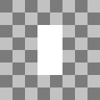
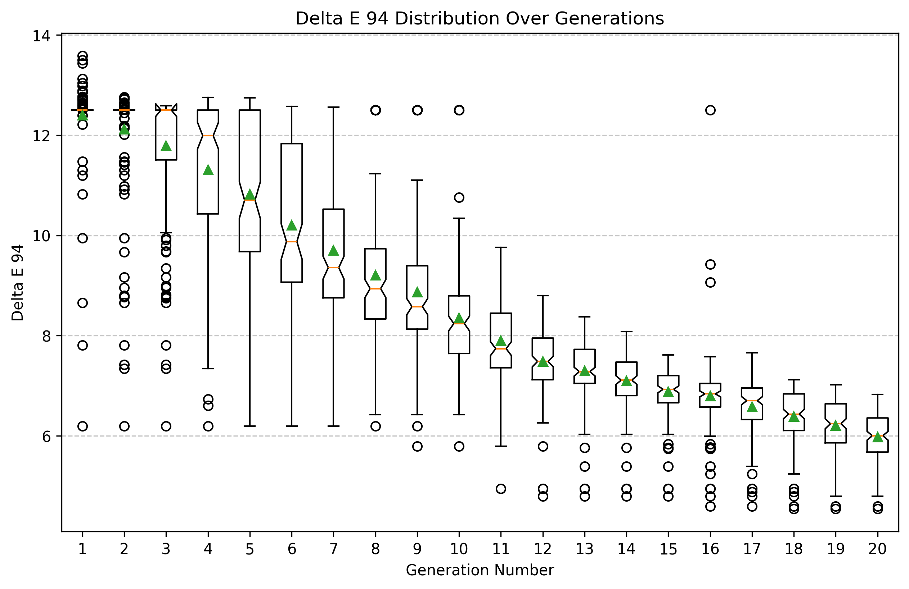
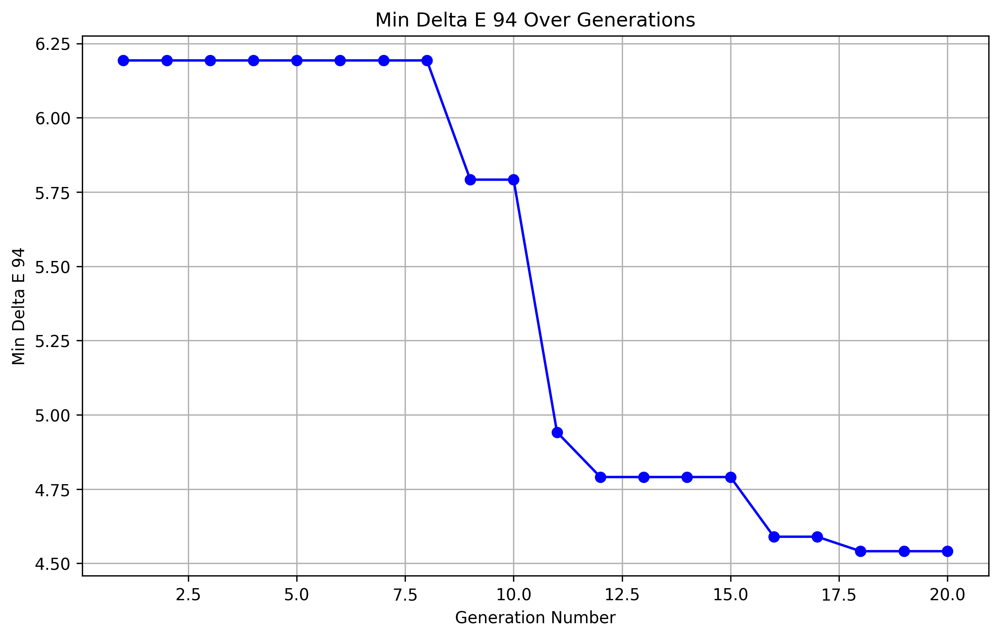
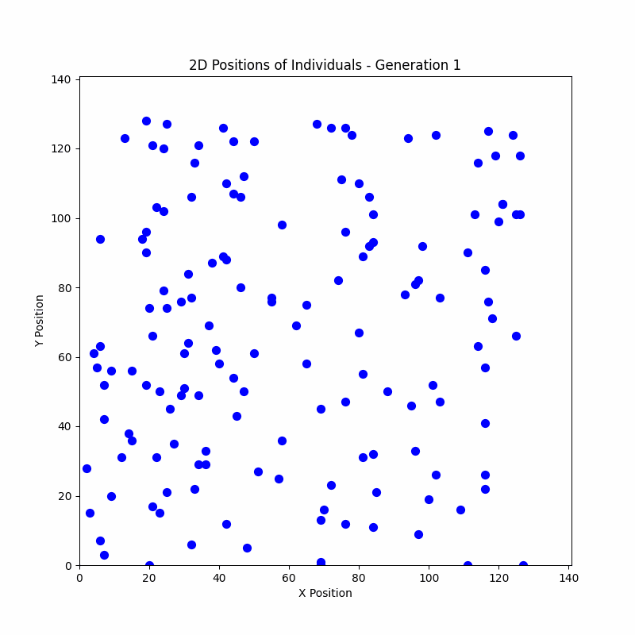
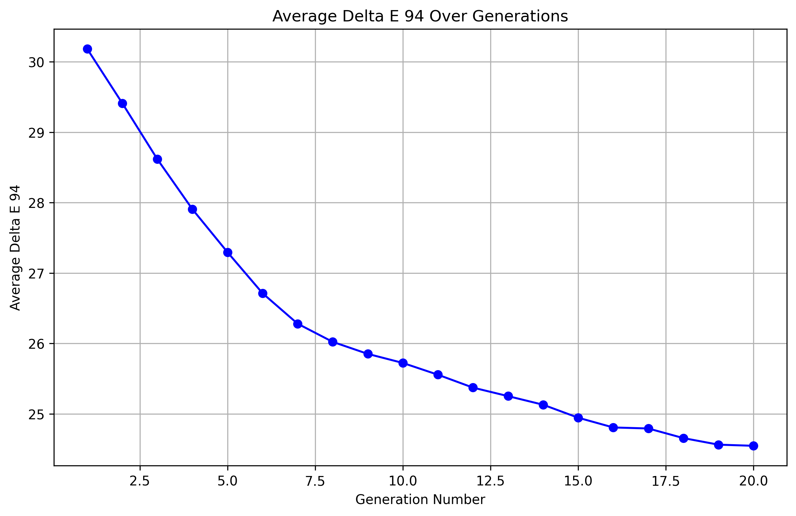
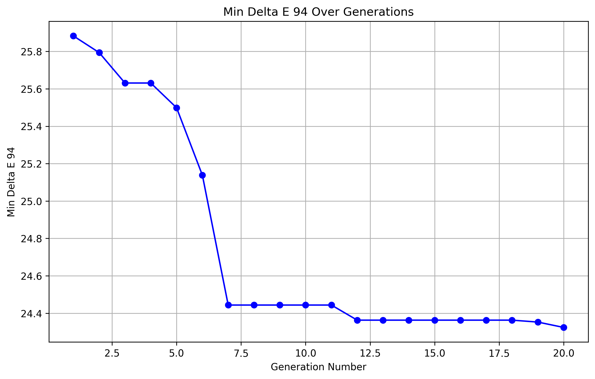
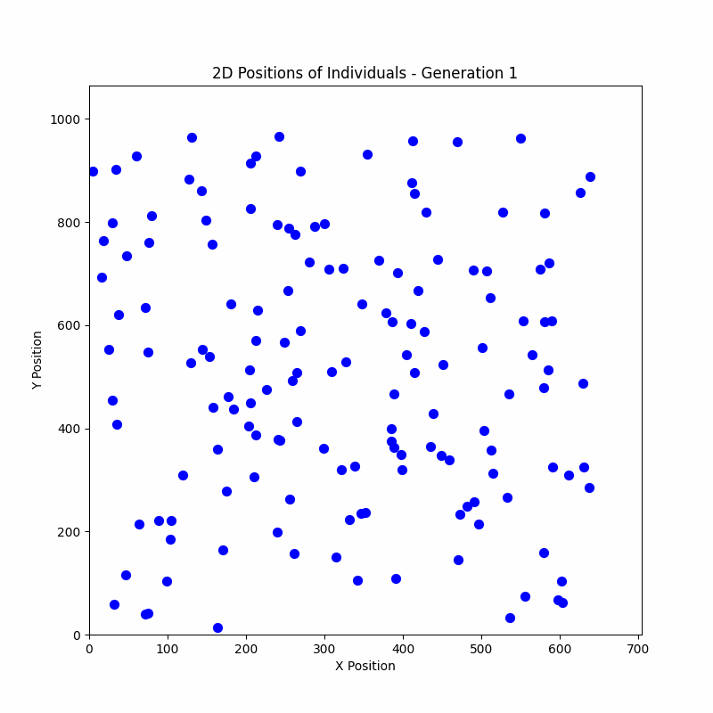
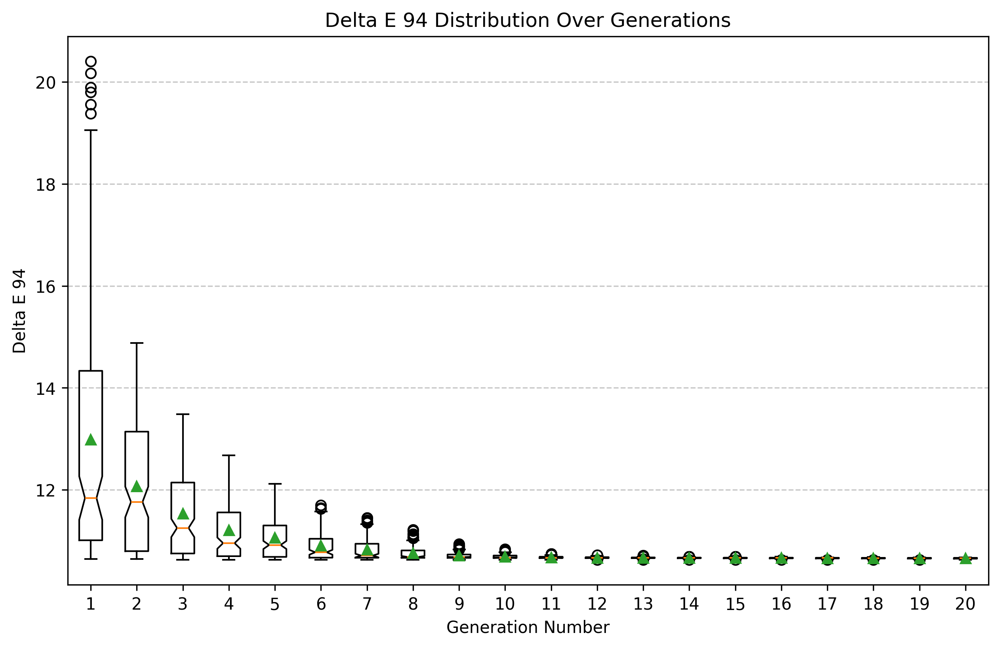
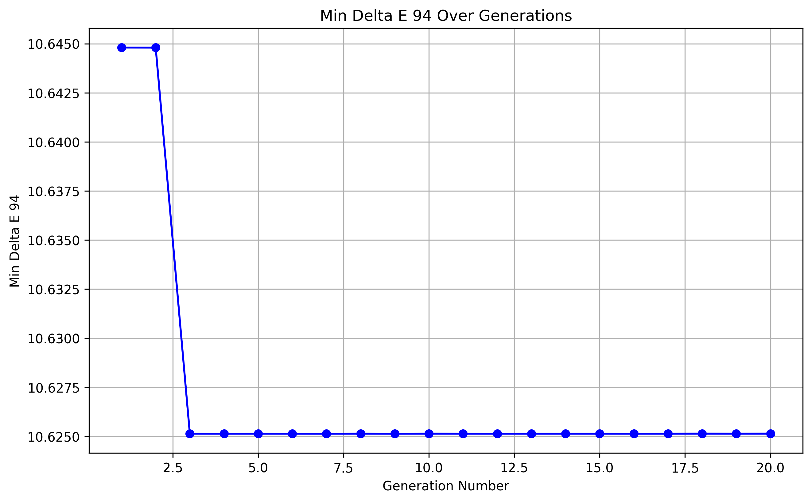
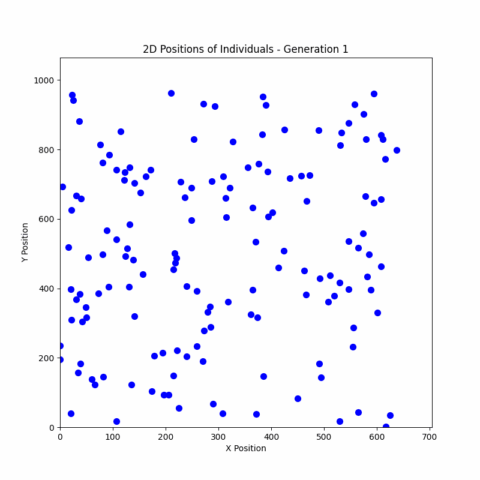

# Algoritmo genético para replicación de imágenes estilizadas

Código de proyecto: GAFSIR (Genetic Algorithm for Stylized Image replication)

_Franco Yudica (13922)_

## Indice

- [Introducción](#introducción)
- [Marco teórico](#marco-teórico)

  - [Introducción de algoritmo genético](#introducción-de-algoritmo-genético)
  - [Justificación](#justificación)

- [Diseño experimental](#diseño-experimental)

  - [Implementación](#implementación)
    - [Generación de imagen](#generación-de-imagen)
      - [Algoritmo de generación de individuo](#algoritmo-de-generación-de-individuo)
        - [Construcción de la imagen](#construcción-de-la-imagen)
        - [Condiciones de parada](#condiciones-de-parada)
    - [Algoritmo genético](#algoritmo-genético)
      - [Individuo](#individuo)
        - [Tinte](#tinte)
      - [Función de fitness](#función-de-fitness)
        - [MSE](#mse-mean-squared-error)
        - [MPA](#mpa-mean-power-accuracy)
      - [Inicialización del algoritmo](#inicialización-del-algoritmo)
      - [Operadores](#operadores)
        - [Selección](#selección)
        - [Cruce](#cruce)
        - [Mutación](#mutación)
        - [Selección de sobrevivientes](#selección-de-sobrevivientes)
        - [Criterio de finalización](#criterio-de-finalización)
    - [Algoritmo aleatorio](#algoritmo-aleatorio)
  - [Métricas](#métricas)
  - [Herramientas](#herramientas)
  - [Experimentos y resultados obtenidos](#experimentos-y-resultados-obtenidos)
    - [Algoritmo de generación de individuos](#algoritmo-de-generación-de-individuos)
      - [Caso de prueba básico](#caso-de-prueba-básico)
      - [Caso real con Mona Lisa](#caso-real-con-mona-lisa)

- [Bibliografía](#bibliografía)

# Introducción

En este proyecto se ha desarrollado un método para generar imágenes _transformadas estéticamente_ utilizando técnicas de computación evolutivas. Al aplicar un algoritmo genético para replicar una imagen a través de modificaciones iterativas, se busca no solo aproximar la imagen original, sino también explorar una estética única, diferente a otras tales como las foto mosaicos, pointillism, pixelart, entre otros.

Se considera que el abordar el problema mediante el uso de IA es una excelente decisión, debido a que esta se centra en el desarrollo de sistemas capaces de adaptarse y tomar decisiones en función de su entorno, siendo esta una característica últil en los procesos de generación de imágenes.

A continuación se explicarán los fundamentos del algoritmo genético, los motivos por los que se decide usarlo, la implementación del mismo, las métricas utilizadas con el fin de establecer el alcance y rendimiento del algoritmo sobre el problema dado, herramientas de implementación, una descripción de los experimentos y resultados obtenidos, en conjunto con un análisis de los mismos y finalmente conlcusiones sobre el proyecto.

# Marco teórico

## Introducción de algoritmo genético

Existe una gran variedad de algoritmos genéticos, pero todos tienen en común la siguiente idea:

Si se cuenta con una población de individuos en un entorno que cuenta con recursos limitados, la competencia entre los individuos por tales recursos produce la supervivencia de los más aptos, también denominada selección natural. Esto causa un aumento en la aptitud de la población remanente.

Dada una función de calidad a maximizar, podemos crear aleatoriamente un conjunto de soluciones candidatas, es decir, elementos del dominio de la función. Luego aplicamos la función de calidad a estas como una medida abstracta de aptitud: cuanto mayor sea, mejor. Con base en estos valores de aptitud, se eligen algunas de las mejores candidatas para sembrar la próxima generación. Esto se realiza aplicando recombinación y/o mutación sobre ellas.

La recombinación es un operador que se aplica a dos o más candidatas seleccionadas (los llamados padres), produciendo una o más nuevas candidatas (los hijos). La mutación se aplica a una candidata y da como resultado una nueva candidata. Por lo tanto, al ejecutar las operaciones de recombinación y mutación sobre los padres, se crea un conjunto de nuevas candidatas (la descendencia). Estas nuevas candidatas tienen su aptitud evaluada y luego compiten, basándose en su aptitud (y posiblemente su edad), con las antiguas por un lugar en la próxima generación. Este proceso puede iterarse hasta que se encuentre una candidata con calidad suficiente (una solución) o se alcance un límite computacional previamente establecido.

Existen dos fuerzas principales que forman la base de los sistemas evolutivos:

- Operadores de variación (recombinación y mutación): crean la diversidad necesaria dentro de la población y, de este modo, facilitan la aparición de novedades.
- Selección: actúa como una fuerza que incrementa la calidad media de las soluciones en la población.

La aplicación combinada de la variación y la selección generalmente conduce a la mejora de los valores de aptitud en poblaciones consecutivas. Es fácil visualizar este proceso como si la evolución estuviera optimizando (o al menos "aproximando") la función de aptitud, acercándose cada vez más a los valores óptimos con el tiempo.

Es importante destacar que muchos componentes de los procesos evolutivos son estocásticos. Por ejemplo, la selección de los mejores individuos no es completamente determinista; incluso los individuos menos aptos suelen tener alguna probabilidad de convertirse en padres o de pasar a la siguiente generación. Durante el proceso de recombinación, la elección de qué atributos de cada padre serán combinados es aleatoria. De manera similar, en el caso de la mutación, la selección de los atributos a modificar en una solución candidata también sigue un comportamiento aleatorio.

[_Introduction to evolutionary computing second edition_](#bibliografía)

## Justificación

En este proyecto se ha optado por utilizar algoritmos genéticos, ya que el proceso de generación de imágenes puede simplificarse como una serie de búsquedas locales.

El problema a resolver se clasifica como una búsqueda local, dado que no se busca la mejor solución absoluta (que en este caso sería la imagen objetivo, la cual se proporciona como parámetro al algoritmo), sino aproximaciones de calidad.

Un algoritmo genético es especialmente adecuado para este problema debido a su capacidad para mantener la diversidad en la población, lo que ayuda a evitar caer en óptimos locales. Además, gracias a los operadores de variación y selección, es posible ampliar el espacio de búsqueda y descubrir soluciones de alta calidad.

**Aspectos adicionales:**

- No es de interés analizar los pasos intermedios que realiza el algoritmo genético para alcanzar la solución.
- El entorno es observable, determinista y estático, lo que lo hace ideal para la aplicación de algoritmos genéticos.
- Los algoritmos genéticos son altamente configurables, lo que permite adaptarlos a diferentes entornos y necesidades. Esta flexibilidad ofrece un amplio margen para explorar diversas estrategias en la generación de imágenes.

# Diseño experimental

## Implementación

### Generación de imagen

La _imagen final_ se generará mediante iteraciones sucesivas y acumulativas de un algoritmo de **generación de individuo**.

#### Algoritmo de generación de individuo

Dadas dos imágenes, una denominada _imagen fuente_ la cuál representa el progreso logrado en la generación de la imagen y otra denominada _imagen objetivo_, se busca encontrar al individuo que, al ser renderizado sobre la _imagen fuente_, produzca una nueva imagen que sea lo más similar posible a la _imagen objetivo_.

Es importante tener en mente la diferencia entre _imagen fuente_ e _imagen objetivo_ debido a que seran ampliamente referidas a partir de este punto.

#### Construcción de la imagen

1. Se inicializa la _imagen fuente_ pintada con el color promedio de la _imagen objetivo_, **Imagen<sub>0</sub>**, **Imagen<sub>i</sub>** = **Imagen<sub>0</sub>**.
2. Se ejecuta el algoritmo de generación de individuo sobre **Imagen<sub>i</sub>**.
3. Se obtiene el mejor individuo y lo renderiza sobre **Imagen<sub>i</sub>**, obteniendo una nueva _imagen fuente_, **Imagen<sub>(i+1)</sub>**.
4. Si se cumple la **_condición de parada_**, la generación de la imagen termina.
5. Vuelve al paso 2, pero con **Imagen<sub>(i+1)</sub>**.

#### Condiciones de parada

- **Cantidad de individuos generados**: La generación de imagen finaliza al alcanzar una cantidad de individuos previamente establecida.
- **Tiempo de ejecución**: La generación de imagen finaliza tras pasar una cantidad de tiempo específica.
- **Valor de métrica**: El proceso de generación de imagen continúa indefinidamente hasta lograr un valor específico de la métrica seleccionada.

### Algoritmo genético

El algoritmo genético es un algoritmo de generación de individuo.

#### Individuo

Los individuos cuentan con una serie de atributos genéticos que brinan suficiente flexibilidad para representar distintas formas y colores:

- **Textura**: El algoritmo genético toma como entrada un conjunto de texturas que serán utilizadas por los individuos. Cada individuo posee un atributo llamado textura, el cual corresponde a una de las texturas proporcionadas al algoritmo. Las texturas pueden asignarse a múltiples individuos, permitiendo su repetición dentro de la población.
- **Posición**: Vector bidimensional dominio [0, N]x[0, M], donde N es el ancho y M el alto de la imagen objetivo. Determina la posición donde se renderizará la textura.
- **Tinte**: Es un color utilizado para pintar la textura. Es vital para que los individuos tomen colores en función de su posición.
- **Tamaño**: Vector bidimensional de enteros que representa la resolución en unidad de pixeles con la que se renderizará la textura. Nótese que el tamaño no necesariamente coincide con la resolución original de la textura seleccionada, brindando mayor versatilidad para poder cubrir regiones de distintos tamaños.
- **Rotación**: La textura puede ser rotada [0, 2PI], teniendo como pivote el centro de la textura.

En definitiva, un individuo puede interpretarse como una sub-imagen que se renderizará sobre la _imagen fuente_ con el objetivo de lograr la mayor semejanza posible con _imagen objetivo_.

##### Tinte

El tinte de un individuo será el color promedio de la sub-imagen de la _imagen objetivo_ que ocupe el individuo.

###### Muestreo de color promedio de subrectángulo

Una vez determinada la posición, tamaño y rotación del individuo, se calcula su AABB (Axis Aligned Bounding Box) o subrectángulo, el cuál describe cuál es la porción de la pantalla que ocupa el individuo.
Posteriormente, se ejecuta un algoritmo que calcula el color promedio ocupado por AABB, el cuál es asignado al individuo.

###### Muestreo de color promedio de subrectángulo enmascarado

El método anterior encuentra un problema importante cuando se trabaja con texturas que incluyen transparencia. Al muestrear todo el subrectángulo se incorporan píxeles en el cálculo del color promedio que pueden no ser visibles debido a la transparencia de la textura del individuo.

Para solucionar este problema, se utiliza el muestreo de color enmascarado. Esta técnica calcula el color promedio dentro de AABB pero solo a partir de aquellos píxeles donde la transparencia de la máscara no es cero.

#### Función de fitness

La función de fitness, recibe como parámetro un indiduo y retorna un valor del intervalo [0.0, 1.0]. Donde el peor fitness posible es 0, y el mejor 1.

```c++
float fitness(individual) {...}
```

Esta función realiza las siguientes tareas:

1. Renderiza al individuo sobre la _imagen fuente_, obteniendo la _imagen fuente del individuo_.
2. Envía la _imagen fuente del individuo_ a una función que se encargará de determinar la diferencia entre esta y la _imagen objetivo_, retornando un valor normalizado que representa el fitness del individuo.

A continuación se detallarán los dos métodos que se han utilizado para determinar el fitness de los individuos. Teniendo en cuenta que los individuos obtienen los colores diréctamente de la _imagen objetivo_, los métodos de cálculo de fitness pueden trabajar con los colores en el espacio RGB. Si los colores fueran aleatorizados, entonces se debería mejorar la función de fitness, cambiando el espacio RGB a uno que sea perceptualmente uniforme, tal como CEILab.

Existen estudios similares que debido a la aleatorización de colores se han encontrado con este mismo problema, y utilizan representaciones de colores en espacios alternativos para su función de fitness, tales como el espacio CEILab o PSNR:

- [Genetic algorithm for image recreation](https://medium.com/@sebastian.charmot/genetic-algorithm-for-image-recreation-4ca546454aaa).

- [Procedural Paintings with Genetic Evolution Algorithm](https://shahriyarshahrabi.medium.com/procedural-paintings-with-genetic-evolution-algorithm-6838a6e64703).

- [EllipScape](https://aisel.aisnet.org/cgi/viewcontent.cgi?article=1613&context=hicss-57).

##### MSE (Mean Squared Error)


_[Figura 1] Fórmula de error cuadrático medio sobre imágenes en espacio de color RGB._

Donde:

- **N**: Es la cantidad de pixeles de la imagen.
- **{R, G, B}**: Es el conjunto de canales sobre los cuales se calculará la diferencia. Cada canal toma un valor normalizado del intervalo: [0.0, 1.0].
- La diferencia de realiza entre la _imagen objetivo_ y la _imagen fuente del individuo_.

Nótese que MSE está dividido por la cantidad de canales, motivo por el cuál MSE tomará el valor de 0 cuando las imágenes sean idénticas, pero tomará 1.0 cuando sean completamente distintas.

Luego, el fitness se calcula como:


_[Figura 2] Fitness partiendo de MSE._

Esto se debe a que el fitness debe medir la similitud y no el error.

MSE es una posible función de fitness que logrará su tarea, pero la distribución de fitness no será la deseada debido a que se trabaja con valores normalizados. Al aplicar cualquier potencia mayor a 1.0 en un valor normalizado, el resultado es un número más chico que el de la base. Esto significa que MSE, en este caso, disminiye el error calculado.

##### MPA (Mean Power Accuracy)

Debido a los motivos mensionados anteriormente, se decidió implementar otra función de fitness:


_[Figura 3]_ Fórmula de fitness utilizando MPA.

A primera vista resulta similar a MSE, pero en realidad tiene una gran diferencia. En lugar de realizar la sumatoria del error cuadrático, se realiza la sumatoria de la exactitud potenciada a cierto valor.

De esta forma la penalización aumenta sobre aquellos canales cuyo error sea mayor.

La siguiente función de fitness es la planteada en [Procedural Paintings with Genetic Evolution Algorithm](https://shahriyarshahrabi.medium.com/procedural-paintings-with-genetic-evolution-algorithm-6838a6e64703), la cuál utiliza la potencia `n = 4`:


_[Figura 4] Fórmula MPA con potencia 4._

#### Inicialización del algoritmo

Se mantiene una población de tamaño fijo a lo largo de toda la ejecución del algoritmo. La población inicial está formada por individuos con los siguientes atributos aleatorizados:

- Textura
- Posición
- Tamaño
- Rotación

Reiterando, el tinte es obtenido mediante un muestreo de la sub-imagen objetivo que ocupa el individuo.

#### Operadores

Los operadores de un algoritmo genético son las funciones principales que manipulan una población de posibles soluciones para buscar la solución óptima a un problema. [Introduction to evolutionary computing](https://link.springer.com/book/10.1007/978-3-662-44874-8).

##### Selección

Este operador determina cuáles son los individuos que serán seleccionados para la reproducción.

No se opta por la selección basada en fitness porque el fitness de los individuos suele ser muy parecido, lo cuál significaría que la selección basada en fitness convergería en la mayoría de los casos a una selección aleatoria.

Por este motivo se utiliza el operador de **selección basado en ranking**, donde la probabilidad de cada individuo de ser seleccionado depende de su ranking y no de su fitness. Este método asegura una distribución probabilística constante, evitando caer en una distribución aleatoria uniforme.

##### Cruce

Este operador recibe a dos padres y crea un hijo.
Los atributos genéticos son utilizados por este método son los siguientes:

- Textura
- Posición
- Tamaño
- Rotación

Debido a que la posición el tamaño y la rotación están formados por números reales, es posible realizar interpolaciones lineales entre los mismos atributos de los padres.

Los factores de interpolación son aleatorizados para cada uno de los atributos con el fin de maximizar la diversidad de los hijos obtenidos y de dar la posibilidad de que el mejor cromosoma de cada padre sea seleccionado.

En el caso de la textura, se debe seleccionar una de las texturas de los dos padres. Para este atributo también se genera un valor aleatorizado a través del cuál se selecciona una de las dos.

```GDScript
var child = Individual.new()

# For each attribute there is a blending t
var texture_t: float = randf()
var position_t: float = randf()
var size_t: float = randf()
var rotation_t: float = randf()

child.texture = parent_a.texture if randf() < texture_t else parent_b.texture

# Lerps
child.position = parent_a.position * position_t + parent_b.position * (1.0 - position_t)
child.size = parent_a.size * size_t + parent_b.size * (1.0 - size_t)
child.rotation = parent_a.rotation * rotation_t + parent_b.rotation * (1.0 - rotation_t)
```

##### Mutación

Tras el nacimiento de un hijo, se aplica el operador de mutación sobre los siguientes atributos:

- **Tamaño**: Se realiza un re-escalado aleatorio a lo ancho y a lo largo. La modificación de la escala toma valores del siguiente intervalo: [-50%, 50%].

- **Posición**: Se aplica una traslación aleatoria la cuál es relativa al tamaño del individuo, tomando esta un valor del intervalo vectorial [-tamaño, tamaño]. De esta forma la traslación es como máximo una unidad de su tamaño actual, brindando un método adaptativo que previene el movimiento excesivo de individuos pequeños.

- **Rotación**: La rotación es modificada por un valor aleatorio del intervalo [-PI/2, PI/2].

Nótese que los atributos de tamaño y posición tienen mutaciones relativas, lo cuál es de caracter fundamental para explorar nuevas soluciones, pero al mismo tiempo no perder el progreso evolutivo logrado.

##### Selección de sobrevivientes

Este operador determina cuáles son los individuos que van a transicionar a la siguiente generación, tras haber creado todos los hijos de la generación actual.

Se utiliza **elitismo**. Elitismo asegura que cierto porcentaje de los mejores individuos de la generación previa sean preservados para la siguiente generación. Esta estrategia permite mantener diversidad y no perder los mejores individuos.

##### Criterio de finalización

**Límite de generaciones**: El algoritmo se detendrá tras un número predefinido de generaciones, lo que permite limitar el tiempo de ejecución.

### Algoritmo aleatorio

Al igual que el algoritmo genético, este también es un [algoritmo de generación de individuo](#algoritmo-de-generación-de-individuo).

Con el fin de evaluar el rendimiento del [algoritmo de generación de individuo genético](#algoritmo-genético), se implementó un algoritmo completamente aleatorio, el cuál sirve como punto de partida.

Este algoritmo generará un único individuo de forma aleatoria, bajo los mismos principios de [iniciación del algoritmo genético](#inicialización-del-algoritmo).

## Métricas

La métrica utilizada para evaluar la similitud entre las imágenes será el [_Delta E (ΔE)_](https://www.viewsonic.com/library/creative-work/what-is-delta-e-and-why-is-it-important-for-color-accuracy/) medio, aplicado en el espacio de color [CIE L*a*b\*](https://en.wikipedia.org/wiki/CIELAB_color_space). Este espacio, a diferencia del RGB, es perceptualmente uniforme, lo que significa que las diferencias calculadas en él se corresponden mejor con la percepción humana de las variaciones de color.

El delta E es una medida estándar utilizada para cuantificar la diferencia entre dos colores en este espacio, y en este proyecto será clave para comparar la imagen generada con la _imagen objetivo_.

De esta forma, se podrá obtener una evaluación más precisa de la calidad de las imágenes generadas, ya que la métrica estará alineada con la percepción visual humana.

Con el objetivo de comparar los resultados de ambos algoritmos utilizando esta métrica, se evaluarán los siguientes escenarios:

- La métrica final obtenida al fijar una cantidad máxima de objetos.
- La cantidad de objetos necesarios para alcanzar una métrica objetivo específica.

### Delta E medio

El cálculo de _Delta E (ΔE)_ se realiza sobre el espacio de colores uniforme _CEILab_, es por este motivo que la _imagen generada_ y la _imagen objetivo_ deben ser transformadas a este espacio.
Una vez realizada tal transformación, obteniendo las componentes de cada pixel _(L, a, b)_, se evalua la función de _Delta E (ΔE)_, y se calcula la media de la siguiente manera:


_[Figura 5] - ΔE medio sobre imágenes en espacio de color CEILab_

- **N** es la cantidad de pixeles de las imágenes, cantidad que debe coincidir.
- **(L, a, b)** son los canales del espacio de color _CEILab_.
- **ΔE(img1, img2)** es la función utilizada para calcular ΔE entre dos pixeles de la _imagen generada_ y la _imagen objetivo_.

A lo largo del tiempo se han desarrollado múltiples funciones para calcular ΔE. En este proyecto se han implementado dos funciones, ΔE de 1976, y la de 1994. Ambas funciones cuentan con exelentes explicaciones sobre su implementación en este [recurso](http://zschuessler.github.io/DeltaE/learn/).

## Herramientas

Para llevar a cabo este trabajo, se emplearon las siguientes herramientas:

- [**Godot 4.3**](https://godotengine.org/): Motor de desarrollo de videojuegos utilizado como plataforma principal.
- [**GDScript**](https://docs.godotengine.org/en/stable/tutorials/scripting/gdscript/gdscript_basics.html): Lenguaje de programación empleado para la lógica del proyecto.
- [**GLSL**](<https://www.khronos.org/opengl/wiki/Core_Language_(GLSL)>): Lenguaje utilizado para la programación de shaders y paralelización de múltiples tareas.
- [**Python**](https://www.python.org/) y la biblioteca [**matplotlib**](https://matplotlib.org/): Herramientas utilizadas para la generación de gráficos y visualización de datos.

## Experimentos y resultados obtenidos

### Algoritmo de generación de individuos

#### Caso de prueba básico

Para poner a prueba el algoritmo de generación de individuos, se decidió definir la imagen objetivo más simple posible, pero que ponga a prueba las capacidades del algoritmo genético.

<div align="center">

|                  _[Figura 6] - Imagen objetivo del caso de prueba básico_                  |
| :----------------------------------------------------------------------------------------: |
|  |

</div>

En la fugura 6 se puede observar una simple imagen de resolución 128x128px, la cuál tiene como objetivo poner a prueba las capacidades del algoritmo genético tanto en la determinación de posición, tamaño, color y rotación. Nótese que se ha seleccionado un rectángulo con el objetivo de que el algoritmo también deba optimizar el atributo genético de la rotación.

Para simplificar las cosas aun más, los individuos solo podrán tomar una textura, ilustrada por la figura 7, la cuál coincide con el rectángulo blanco que se busca replicar de la figura 6.

<div align="center">

|                    _[Figura 7] - Textura utilizada por los individuos_                    |
| :---------------------------------------------------------------------------------------: |
|  |

</div>

(Nótese que se han añadido los cuadros típicos de imágenes con transparencia manualmente para que se pueda visualizar la imagen sobre un fondo blanco. En la práctica, los cuadros grises representan los pixeles transparentes).

Además, la _imagen fuente_, es decir, sobre la cuál se renderizarán los individuos es la siguiente:

<div align="center">

|                                _[Figura 8] - Imagen fuente_                                |
| :----------------------------------------------------------------------------------------: |
|  |

</div>

Se plantea este escenario porque es posible agregar un individuo sobre la imagen fuente y obtener una imagen igual a la objetivo.

##### Resultados

El algoritmo cuenta con los siguientes parámetros:

<div align="center">

| Parámetro                | Valor |
| ------------------------ | ----- |
| Generaciones             | 20    |
| Población                | 150   |
| Probabilidad de mutación | 20%   |
| Porcentaje elitista      | 25%   |

</div>

Tras ejectutar el algoritmo genético durante 2,6 segundos, se obtuvo el siguiente individuo:

<div align="center">
<table>
  <tr>
    <!-- Table on the left -->
    <td>
      <table>
        <tr><th>Attribute</th><th>Value</th></tr>
        <tr><td>Fitness</td><td>0.95458984375</td></tr>
        <tr><td>Metric Score</td><td>4.541015625</td></tr>
        <tr><td>Position X</td><td>63</td></tr>
        <tr><td>Position Y</td><td>60</td></tr>
        <tr><td>Size X</td><td>96.3577575683594</td></tr>
        <tr><td>Size Y</td><td>108.490371704102</td></tr>
        <tr><td>Rotation</td><td>3.27535051368461</td></tr>
      </table>
    </td>
    <!-- Image on the right -->
    <td align="center">
      <table>
        <tr><th><i>[Figura 9] - Imagen fuente del individuo generado</i></th></tr>
        <tr>
          <td>
            <figure>
              
            </figure>
          </td>
        </tr>
      </table>
    </td>
  </tr>
</table>
</div>

La figura 10 como la métrica varía a lo largo de las generaciones. Se puede observar que esta disminuye, como es esperado en una métrica que representa el error.

|                                  _[Figura 10] - Métrica media por generación_                                  |
| :------------------------------------------------------------------------------------------------------------: |
|  |

La figura 11 ilustra los gráficos de caja y se observa que la dispersión de los valores de métrica de cada individuo disminuye a medida que aumentan las generaciones. Esto representa un comportamiento adecuado, donde el algoritmo inicialmente realiza exploración, y a medida que avanzan las generaciones se hace explotación.

|                        _[Figura 11] - Gráficos de caja de métrica por generación_                         |
| :-------------------------------------------------------------------------------------------------------: |
|  |

Los gráficos anteriores representan el comportamiento evolutivo en conjunto de la población, pero también es de interés analizar cuál es el valor de la mejor solución candidata en cada generación:

|                 _[Figura 12] - Valor de la métrica del mejor individuo de cada generación_                 |
| :--------------------------------------------------------------------------------------------------------: |
|  |

La figura 13 muesta de manera intuitiva la posición de los individuos en cada una de las generaciones donde claramente se puede ver como es que el atributo posición de los individuos evoluciona al centro, siendo esta la posición ideal.

<div align="center">

|                    _[Figura 13] - Posiciones de individuos por generación_                     |
| :--------------------------------------------------------------------------------------------: |
|  |

</div>

#### Caso real con Mona Lisa

La Mona Lisa será utilizada como la imagen estándar a partir de este punto con el fin de mantener constante la mayor cantidad de parámetros.

##### Resultados desde cero

Se realiza una ejecución desde cero, lo cuál significa que la imagen fuente no tiene nada renderizado, únicamente el color promedio de la imagen objetivo.

|                       _[Figura 14] - Imagen fuente_                        |  _[Figura 15] - Imagen objetivo: Mona Lisa original_   |
| :------------------------------------------------------------------------: | :----------------------------------------------------: |
|  |  |

El algoritmo cuenta con los siguientes parámetros:

<div align="center">

| Parámetro                | Valor |
| ------------------------ | ----- |
| Generaciones             | 20    |
| Población                | 150   |
| Probabilidad de mutación | 20%   |
| Porcentaje elitista      | 25%   |

</div>

Tras ejectutar el algoritmo genético durante 5,5 segundos, se obtuvo el siguiente individuo:

<div align="center">
<table>
  <tr>
    <!-- Table on the left -->
    <td>
      <table>
        <tr><th>Attribute</th><th>Value</th></tr>
        <tr><td>Fitness</td><td>0.644296525266873</td></tr>
        <tr><td>Metric Score</td><td>24.323813597624</td></tr>
        <tr><td>Position X</td><td>404</td></tr>
        <tr><td>Position Y</td><td>821</td></tr>
        <tr><td>Size X</td><td>688.973754882812</td></tr>
        <tr><td>Size Y</td><td>1072.1259765625</td></tr>
        <tr><td>Rotation</td><td>4.64755909331613</td></tr>
      </table>
    </td>
    <!-- Image on the right -->
    <td align="center">
      <table>
        <tr><th><i>[Figura 16] - Imagen fuente del individuo</i></th></tr>
        <tr>
          <td>
            <figure>
              
            </figure>
          </td>
        </tr>
      </table>
    </td>
  </tr>
</table>
</div>

La figura 17 como la métrica varía a lo largo de las generaciones.

|                                  _[Figura 17] - Métrica media por generación_                                   |
| :-------------------------------------------------------------------------------------------------------------: |
|  |

La figura 18 muesta los gráficos de caja de la métrica por generación. Se puede observar un comportamiento similar al del caso básico, pero con una mayor definición entre la exploración y la explotación en las últimas generaciones.

|                         _[Figura 18] - Gráficos de caja de métrica por generación_                         |
| :--------------------------------------------------------------------------------------------------------: |
|  |

|                 _[Figura 19] - Valor de la métrica del mejor individuo de cada generación_                  |
| :---------------------------------------------------------------------------------------------------------: |
|  |

En la figura 20, se ilustran las posiciones por generación de los individuos donde se puede observar que los puntos se trasladan hacia arriba, mientras que el individuo fue renderizado en la parte inferior de la imagen. Esto no es un error porque la orientación del eje Y en Godot y matplotlib están invertidos.

|                   _[Figura 20] - Posiciones de los individuos por generación_                   |                                _[Figura 21] - Imagen fuente del individuo_                                |
| :---------------------------------------------------------------------------------------------: | :-------------------------------------------------------------------------------------------------------: |
|  |  |

En definitiva, se observa el correcto funcionamiento del algoritmo, cuyos resultados coinciden con el simple caso del rectángulo.

##### Resultados con progreso

En el experimento anterior se evaluaron estadísticas del algoritmo genético tomando una imagen fuente vacía. Debido a que se utilizarán iteraciones sucesivas del algoritmo genético, el estudio del caso anterior no basta para poder asegurar el correcto funcionamiento del algoritmo en el proceso de generación de imágenes. Es por este motivo que a continuación se hará un análisis similar pero con un punto de partida más avanzado, donde la imagen fuente no está vacía, simulando una etapa de generación de imagen.

|                        _[Figura 22] - Imagen fuente avanzada con 50 individuos_                         |  _[Figura 23] - Imagen objetivo: Mona Lisa original_   |
| :-----------------------------------------------------------------------------------------------------: | :----------------------------------------------------: |
|  |  |

El algoritmo cuenta con los mismos parámetros que se utilizaron en la ejecución desde cero.

Tras ejectutar el algoritmo genético durante 4,5 segundos, se obtuvo el siguiente individuo:
| Attribute | Value |
|----------------|------------------|
| Fitness | 0.808261032735021 |
| Metric Score | 10.6251412383781 |
| Position X | 499 |
| Position Y | 445 |
| Size X | 49.4948654174805 |
| Size Y | 291.158996582031 |
| Rotation | 2.45406044618326 |

A continuación, en la figura 24 y 25 se pueden observar las imágenes fuentes de los individuos generados en la etapa 50 y 51 correspondientemente, siendo el de la etapa 51 el recientemente generado:

|                              _[Figura 24] - Imagen fuente de la etapa 50_                               |                            _[Figura 25] - Imagen fuente de la etapa 51_                             |  _[Figura 26] - Imagen objetivo: Mona Lisa original_   |
| :-----------------------------------------------------------------------------------------------------: | :-------------------------------------------------------------------------------------------------: | :----------------------------------------------------: |
|  |  |  |

Se observa que se el algoritmo generó un individuo el cuál se encuentra a la altura del hombro.

La figura 26 ilustra como la métrica varía a lo largo de las generaciones.

|                                      _[Figura 26] - Métrica media por generación_                                      |
| :--------------------------------------------------------------------------------------------------------------------: |
|  |

En la figura 27 se puede observar un comportamiento similar al del caso desde cero, pero se presenta una explotación mucho más rápida y menor exploración.

|                            _[Figura 27] - Gráficos de caja de métrica por generación_                             |
| :---------------------------------------------------------------------------------------------------------------: |
|  |

En la figura 28 se pueden observar los efectos de la rápida explotación debido a que el algoritmo quedó atascado en un mismo valor a partir de la tercera generación.

|                     _[Figura 28] - Valor de la métrica del mejor individuo de cada generación_                     |
| :----------------------------------------------------------------------------------------------------------------: |
|  |

<div align="center">

|                      _[Figura 29] - Posiciones de los individuos por generación_                       |
| :----------------------------------------------------------------------------------------------------: |
|  |

</div>

En la figura 29, a diferencia de los gráficos ilustrados en la figura 27 y 28, se observa que la explotación sobre el atributo posición no resulta ser tan prematuro como los gráficos anteriores ilustraban. Es probable que dada la imagen fuente sobre la cuál se ejecutó el algoritmo, el algoritmo construyera una población con atributos diversos pero con fitness similares. De hecho, si se observa el gráfico en detalle, se puede observar que hay varios puntos, es decir individuos, cuya posición se mantiene constante a lo lagro de las generaciones, lo cuál significa que estos son buenas soluciones por encima del percentil 80 de la población.

# Bibliografía

- [Introduction to evolutionary computing](https://link.springer.com/book/10.1007/978-3-662-44874-8)
- Artificial Intelligence A Modern Approach, Third Edition
- [What is Delta E? And Why Is It Important for Color Accuracy? ](https://www.viewsonic.com/library/creative-work/what-is-delta-e-and-why-is-it-important-for-color-accuracy/)
- [Formulación matemática de _delta e_](http://zschuessler.github.io/DeltaE/learn/)

Papers y proyectos:

- [Inspiración del proyecto](https://www.youtube.com/watch?v=6aXx6RA1IK4)
- [Genetic algorithm for image recreation](https://medium.com/@sebastian.charmot/genetic-algorithm-for-image-recreation-4ca546454aaa). Utilización de _delta e_.

- [Grow Your Own Picture Genetic Algorithms & Generative Art](https://chriscummins.cc/s/genetics/#). Aplicación web para generar imagen con algoritmos genéticos.

- [Procedural paintings with genetic evolution algorithm](https://shahriyarshahrabi.medium.com/procedural-paintings-with-genetic-evolution-algorithm-6838a6e64703). Cálculo de métrica con _delta e_ sobre el espacio [_CIELab_](https://en.wikipedia.org/wiki/CIELAB_color_space), mismos atributos genéticos propuestos en este proyecto y paralelización con [_compute shaders_](https://www.khronos.org/opengl/wiki/Compute_Shader).

- [Genetic drawing](https://github.com/anopara/genetic-drawing). Código fuente para replicar imágenes como pinturas.

- [EllipScape: A Genetic Algorithm Based Approach to Non-Photorealistic Colored Image Reconstruction for Evolutionary Art](https://aisel.aisnet.org/cgi/viewcontent.cgi?article=1613&context=hicss-57). Algoritmo genético completamente distito, pero utiliza como función de fitness y métrica _Peak Signal-to-Noise_
  Ratio (PSNR). Se muestran resultados en cuanto a los tiempos de ejecución y como cambia la función de fitness a lo largo de las generaciones.
